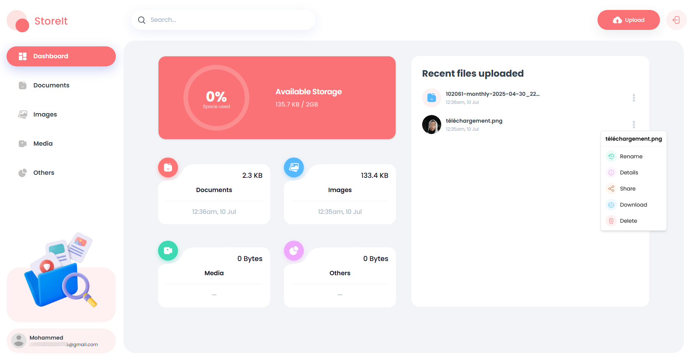

# StoreIt

**StoreIt** est une solution moderne de stockage de fichiers qui met en avant des fonctionnalités simples, rapides et sécurisées. Ce projet illustre un exemple de design intuitif et performant, conçu avec des technologies modernes.

> 🏷 **Slogan** : "StoreIt - The only storage solution you need."

🎉 **Essayez l'application ici** : [StoreIt](https://mhmedk-drive.vercel.app/)

---

## 🌟 À Propos du Projet

**StoreIt** permet aux utilisateurs de gérer leurs fichiers avec une expérience utilisateur fluide. Vous pouvez uploader, organiser et visualiser vos fichiers en toute simplicité. Ce projet est conçu pour servir d'exemple à la fois de compétences techniques et de soin porté au design.

### Objectifs

- Offrir une **interface moderne**, avec un design épuré et réactif.
- Garantir une **expérience utilisateur optimale**, que ce soit sur desktop ou mobile.
- Démontrer l'utilisation des **outils frontend avancés**, des animations CSS fluides et des composants interactifs.
- Visualiser les **compétences techniques** grâce à l’intégration de bibliothèques tierces.

---

## 🛠️ Construit Avec

- **Framework Frontend** : [Next.js](https://nextjs.org/) (v15.1.4)
- **Langage** : TypeScript
- **Framework CSS** : [Tailwind CSS](https://tailwindcss.com/) (v3.4.1)
- **Technologies Complémentaires** :
  - **@radix-ui** : Composants interactifs accessibles.
  - **react-hook-form** : Gestion flexible des formulaires.
  - **recharts** : Création de graphiques interactifs pour la visualisation des données.
  - **toast** : Notifications en temps réel.
  - **Input-otp** : Intégration d'un champ OTP sécurisé.

---

## 📚 Fonctionnalités Clés

- 🗂 **Gestion de fichiers optimisée** :
  - Téléchargement simple et rapide.
  - Organisation et visualisation intuitives.

- 📈 **Graphiques dynamiques** :
  - Données et statistiques présentées de manière interactive et visuelle.

- 🔔 **Notifications en temps réel** :
  - Des retours instantanés pour une gestion utilisateur fluide.

- 📱 **Responsive Design** :
  - Une interface adaptable pour mobile, tablette et desktop.

- 🎨 **Design personnalisé** :
  - Utilisation de [Tailwind CSS](https://tailwindcss.com/) avec des palettes de couleurs et des animations sur mesure.

- 🔒 **Sécurité et confidentialité** :
  - Un accès sécurisé pour toutes les fonctionnalités.

---

## 📂 Structure du Projet

Le projet est organisé de manière modulable, facilitant les ajouts et les modifications :

- **app/** : Pages principales gérées par le framework Next.js.
- **components/** : Tous les composants d'interface utilisateur (cartelettes, formulaire, uploader, etc.).
- **hooks/** : Hooks personnalisés permettant de centraliser la logique d'application.
- **public/** : Images, fichiers statiques et autres ressources accessibles publiquement.
- **lib/** : Utilitaires et logique métier individuelle.
- **styles/** : Styles globaux et personnalisés via Tailwind CSS.
- **types/** : Typages TypeScript partagés (ex. : définitions pour les formulaires, données des graphiques, etc.).

---

## 🧰 Installation & Lancement Local

Pour tester ou modifier **StoreIt** localement :

1. Clonez le projet :

   ```bash
   git clone https://github.com/votre-utilisateur/storeit.git
   cd storeit
   ```

2. Installez les dépendances avec npm :

   ```bash
   npm install
   ```

3. Démarrez le serveur de développement :

   ```bash
   npm run dev
   ```

4. Ouvrez votre navigateur sur [http://localhost:3000](http://localhost:3000).

---

## 🎯 Aperçu Visuel

🌐 **[Découvrez l'application ici](https://mhmedk-drive.vercel.app/)**.

Captures d'écran du tableau de bord :




---

## 🤝 Contribution

Les contributions sont les bienvenues pour améliorer **StoreIt** :

1. **Forkez** ce dépôt.
2. Créez une branche avec votre idée ou amélioration :
   ```bash
   git checkout -b feat/nouvelle-fonctionnalite
   ```
3. Enregistrez vos changements :
   ```bash
   git commit -m "Ajout d'une nouvelle fonctionnalité"
   ```
4. Poussez sur votre branche :
   ```bash
   git push origin feat/nouvelle-fonctionnalite
   ```
5. Faites une **Pull Request** en décrivant clairement vos modifications.

---

## ✨ Remerciements

Merci d'avoir jeté un œil à **StoreIt** 🙌. Si vous avez des questions, des retours ou voulez simplement discuter d’idées, n'hésitez pas à me **contacter**.
